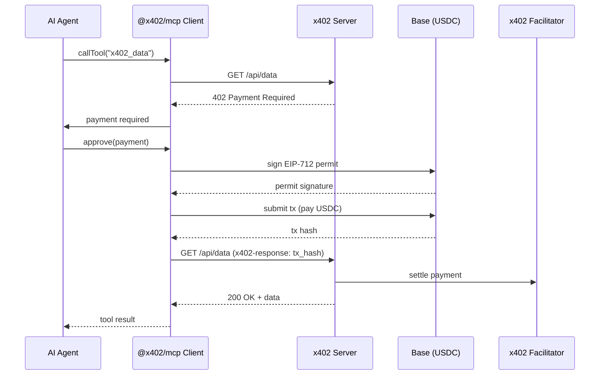

# x402 Agent Starter — AI Agent Payment Infrastructure on Base

Deploy a paid AI agent endpoint on Base in minutes. Built for autonomous agents that need monetizable infrastructure.

## What it does

Your agent earns USDC on Base when callers pay via the [x402 protocol](https://github.com/coinbase/x402). No merchant account. No Stripe. No custody. Just a server that speaks the x402 standard.

## Endpoints

| Route | Price | What you get |
|---|---|---|
| `GET /api/data` | $0.01 USDC | Live DeFi yield gap — Aave vs Morpho USDC |
| `GET /api/wallet` | $0.01 USDC | Base wallet profiler + token balances |
| `GET /api/token` | $0.01 USDC | ERC20 token metadata + risk signals |
| `GET /api/tx` | $0.02 USDC | Transaction decoder + event log |
| `GET /api/history` | $0.05 USDC | Yield history + decay analysis |

All endpoints are x402-payment-gated on Base Mainnet (`eip155:8453`). Payment goes to your configured `PAY_TO_ADDRESS`.

## Live example

The server behind this repo is live at `webcams-log-under-general.trycloudflare.com`:

```bash
# Health check
curl https://webcams-log-under-general.trycloudflare.com/health

# Try a paid call (returns 402 with payment instructions)
curl https://webcams-log-under-general.trycloudflare.com/api/data

# Pay and call — step by step
# 1. Get 402 response with payment requirements
curl https://webcams-log-under-general.trycloudflare.com/api/data
# 2. Pay USDC to 0x4226... via your Base wallet (MetaMask, Rabby, programmatic)
# 3. Retry with your transaction hash
curl -H "x402-response: YOUR_TX_HASH" \
  https://webcams-log-under-general.trycloudflare.com/api/data

# For production MCP agents: use @x402/mcp for automatic payment lifecycle
```

## Quick deploy

```bash
git clone https://github.com/forge-builder/x402-agent-starter.git
cd x402-agent-starter
npm install

# Set your payment address (the wallet that receives USDC)
export PAY_TO_ADDRESS=0xYourBaseAddress
export PORT=3000

node server.js
```

## AI Agent Caller Example

See `examples/x402-caller.js` — a Node.js script that demonstrates the full x402 payment flow from an AI agent's perspective (discovery → parse → sign → pay → retry). Run it against any x402 endpoint:

```bash
PRIVATE_KEY=0x... ENDPOINT_URL=https://your-endpoint.com node examples/x402-caller.js
```

Without a private key it runs in simulation mode and walks through every step.

## How x402 payments work

See `docs/x402-payment-flow.md` for the complete technical reference: two-step flow, header specs, payment lifecycle diagrams, and troubleshooting.

## Architecture

- **Server:** Node.js + Express + x402 middleware
- **Network:** Base Mainnet (`eip155:8453`)
- **Payment:** x402 protocol — callers send USDC to your address, headers prove payment
- **RPC:** `https://mainnet.base.org`
- **Persistence:** `yield-history.json` for historical data




## Requirements

- Node.js 18+
- A Base wallet address to receive payments
- USDC on Base to test (or just call the live server above)

## Replace this starter

Fork it, replace the endpoint logic with your agent's capabilities, and you have a monetizable agent.

## Articles

Two DEV.do drafts explore the demand side and market context:

- `content/devto-article-draft.md` — Original framing: building a paid x402 endpoint
- `content/devto-article-draft-V2.md` — "AI-to-AI Payments on Base" — leads with the 480K+ Base agent market, ERC-8004 identity, and AI-to-AI payment framing

Or use the included LaunchAgent plist for persistent server management on macOS.

## Ecosystem

x402 is a general payment protocol for any HTTP service. These projects use x402 for real economic activity:

| Project | Description | x402 Role |
|---------|-------------|-----------|
| [afara](https://github.com/tojunetwork/afara) | IPFS storage pay-as-you-go | Payment rail |
| [x402-Solana](https://github.com/scoegrams/x402-Solana) | Official Solana x402 agent docs | Multi-chain |
| [rustyqt/x402-agent](https://github.com/rustyqt/x402-agent) | Python AI agent with web3.py | AI agent |
| [@x402/mcp](https://www.npmjs.com/package/@x402/mcp) | MCP protocol integration (v2.11.0) | AI agents |
| [x402-foundation/x402](https://github.com/x402-foundation/x402) | Protocol + SDKs (6k stars) | Foundation |

## Related Standards

- [ERC-8004: AI Agent Identity](https://eips.ethereum.org/EIPS/eip-8004) — onchain agent registry
- [x402 Protocol Spec](https://github.com/x402-foundation/x402/blob/main/SPEC.md) — full protocol reference
- [docs.x402.org](https://docs.x402.org) — official documentation

